# GlobeTrotter

**Personalised multi-city travel planning.** Build an itinerary city by city, attach
activities to each stop, watch the budget update as you go, and share the finished
plan with a public link.

Built for the **Odoo x LDCE Ahmedabad Hackathon 2026** — problem statement *GlobeTrotter*.

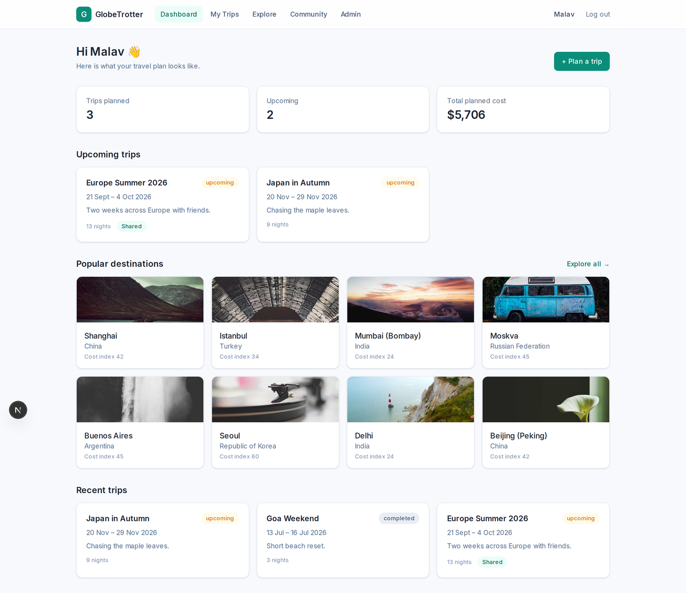

---

## What it does

| | |
|---|---|
| **Plan** | Create a trip, add city stops with dates, reorder them, attach activities |
| **Discover** | Search 400 real cities and 4,800 activities with filter, group-by and sort |
| **Budget** | Automatic breakdown by transport / stay / meals / activities, with per-day costs and over-budget alerts |
| **Visualise** | Day-by-day timeline view and a month calendar view of the same trip |
| **Share** | Publish a read-only public link; anyone can view it and copy the trip into their own account |
| **Community** | Browse every publicly shared itinerary |
| **Admin** | Platform analytics — popular cities, booked activities, user table |

---

## Screenshots

### Itinerary builder
Add stops, set per-stop costs, attach activities, reorder the route.

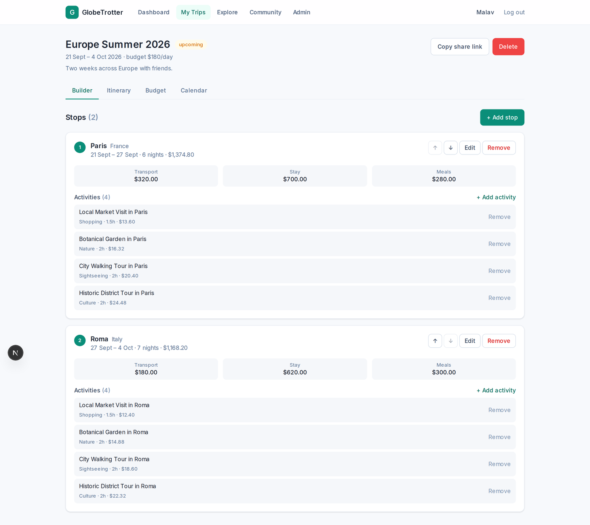

### Budget with over-budget alerts
Costs roll up from the itinerary automatically. Days that exceed the daily budget are flagged in red.

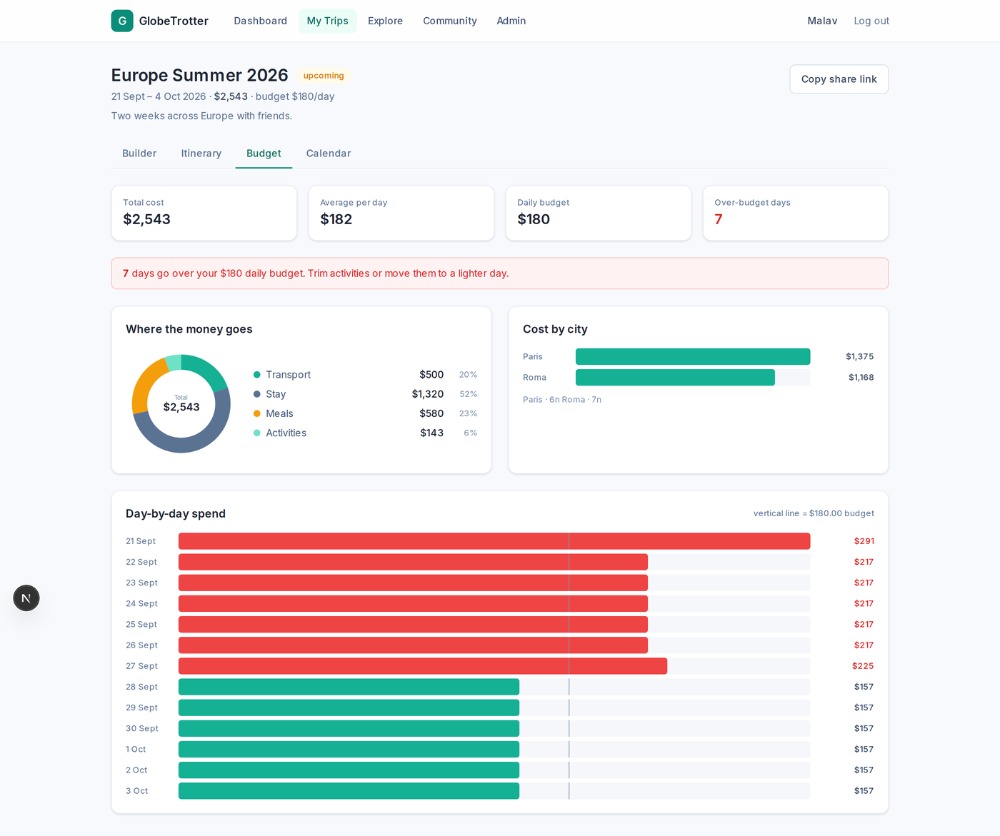

### Day-by-day itinerary
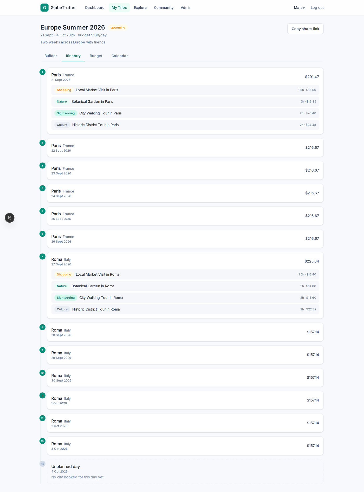

### Calendar
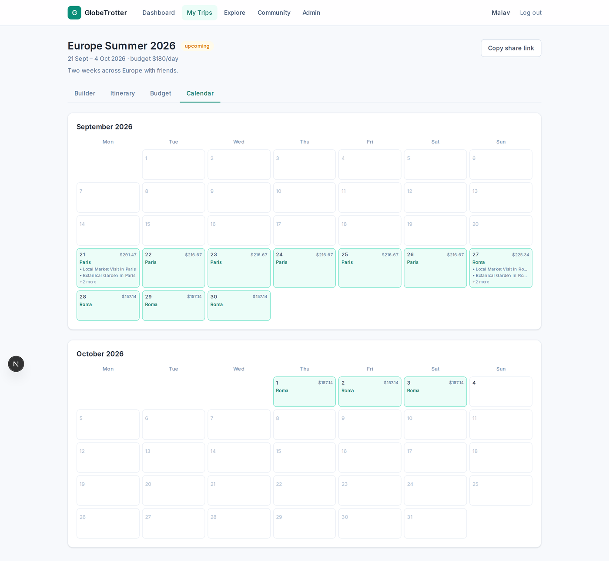

### Explore — search, filter, group by, sort
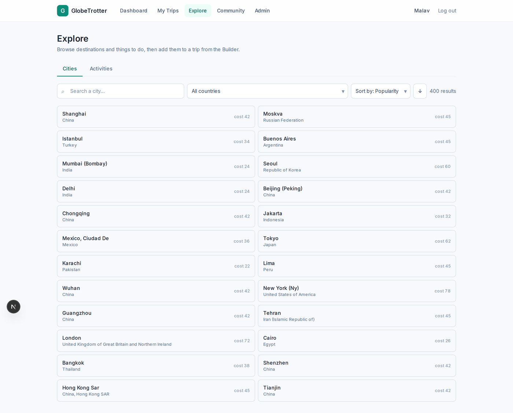

### Public shared itinerary
No login needed. "Copy this trip" clones the whole plan into your account.

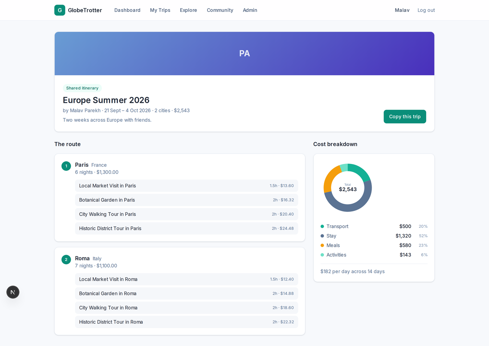

### Community feed
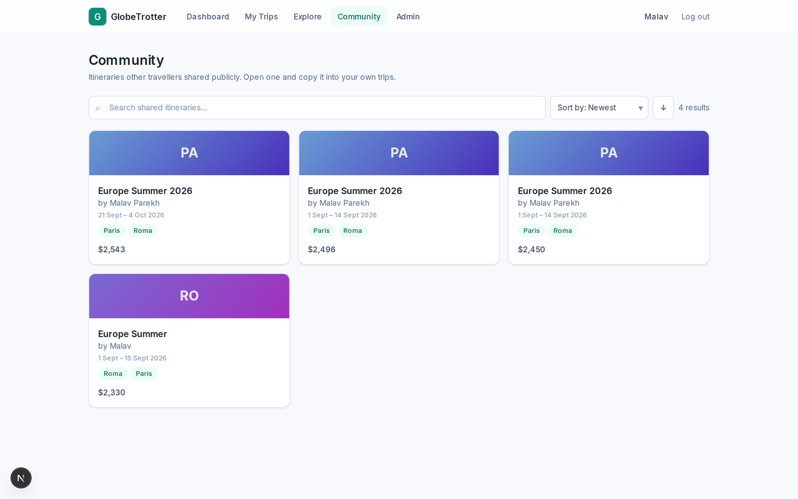

### Admin analytics
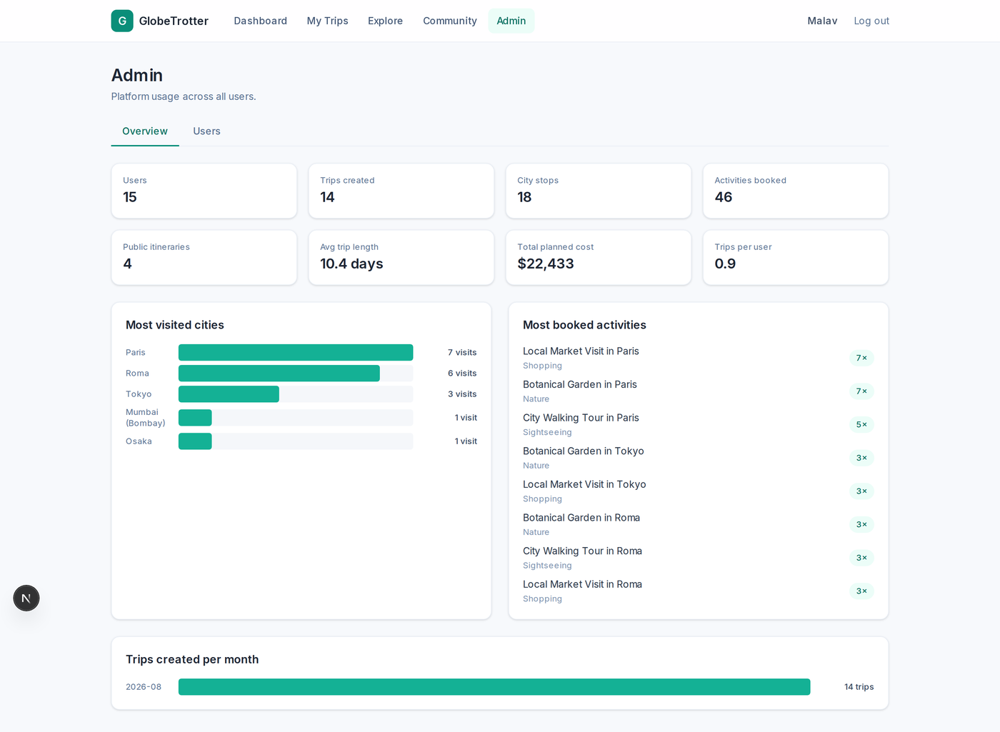

### Responsive
<p>
  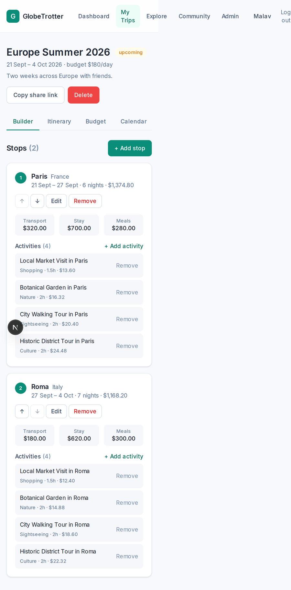
  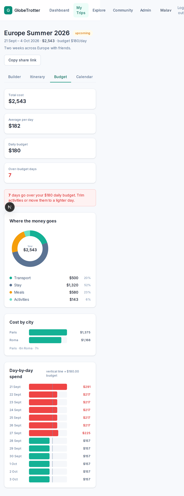
</p>

---

## Tech stack

| Layer | Choice | Why |
|---|---|---|
| Backend | **FastAPI** (Python 3.12) | Typed request/response models, generated OpenAPI docs |
| Database | **PostgreSQL 16** + SQLAlchemy 2.0 | The problem is relational — nested trips, stops and activities |
| Auth | **JWT** + bcrypt | Stateless, works cleanly across a separate frontend |
| Frontend | **Next.js 16** (App Router) + React 19 + TypeScript | |
| Styling | **Tailwind CSS 4** with a custom token theme | One palette, applied consistently |
| Charts | Hand-written **inline SVG** | No chart library — the app renders fully offline |

---

## Data model

Everything in the app is one tree, and every screen is a different view of it.

```
User ──< Trip ──< TripStop ──< StopActivity
                     │              │
                  City ─────────< Activity
                (seeded)          (seeded)
```

| Table | Holds |
|---|---|
| `users` | Account, profile, admin flag |
| `cities` | 400 seeded real cities — country, cost index, popularity |
| `activities` | 4,800 seeded activities, priced against the city's cost index |
| `trips` | Name, dates, optional daily budget, share slug |
| `trip_stops` | One city visit — dates, order, transport / stay / meal cost |
| `stop_activities` | An activity booked at a stop, with optional cost override and notes |

Deliberate choices worth calling out:

- **`ondelete` differs per foreign key.** `trip_id` cascades (delete a trip, its stops go too);
  `city_id` restricts (a city cannot be deleted while trips reference it).
- **Money is `Numeric(10,2)`, never `Float`** — floats lose cents.
- **Trip status is a computed property, not a column.** A stored status would be stale by the
  next morning; it is derived from the dates on every read.
- **A unique constraint on `(stop_id, activity_id)`** stops duplicate bookings at the database
  level, not just in application code.

---

## Real data, not static JSON

`seed.py` fetches live city data from the [countriesnow](https://countriesnow.space) API,
keeps the 400 most populous cities, assigns each a cost-of-living index, and writes everything
into PostgreSQL. Activities are generated per city with prices scaled to that city's cost index.

After seeding, **the app never touches the network** — every search, filter and sort is a real
SQL query against the local database. That keeps the demo working without internet.

---

## Running it locally

**Requirements:** Python 3.12+, Node 20+, PostgreSQL 16+

### Backend

```bash
cd backend
python3 -m venv venv
source venv/bin/activate
pip install -r requirements.txt

createdb globetrotter
cp .env.example .env          # adjust DATABASE_URL and SECRET_KEY if needed

python seed.py                # 400 cities + 4,800 activities (needs internet once)
python seed_demo.py           # optional: demo account with sample trips

uvicorn app.main:app --reload --port 8001
```

API docs: **http://localhost:8001/docs**

### Frontend

```bash
cd frontend
npm install
cp .env.example .env.local    # NEXT_PUBLIC_API_URL=http://localhost:8001
npm run dev
```

App: **http://localhost:3000**

### Demo login

```
demo@globetrotter.app / demo1234      (has admin access)
```

Public itinerary without logging in: `/share/europe-summer-demo`

To make any other account an admin:

```bash
cd backend && python make_admin.py you@example.com
```

---

## API

28 endpoints, all documented at `/docs`.

| Group | Endpoints |
|---|---|
| Auth | `POST /api/auth/signup`, `POST /api/auth/login`, `GET|PATCH /api/auth/me` |
| Catalog | `GET /api/cities`, `/api/cities/{id}`, `/api/cities/countries`, `/api/activities`, `/api/activities/categories` |
| Trips | `POST|GET /api/trips`, `GET|PATCH|DELETE /api/trips/{id}`, `POST /api/trips/{id}/share` |
| Itinerary | `POST /api/trips/{id}/stops`, `PATCH|DELETE /api/stops/{id}`, `POST /api/trips/{id}/reorder`, `POST /api/stops/{id}/activities`, `DELETE /api/stop-activities/{id}` |
| Views | `GET /api/trips/{id}/budget`, `/api/trips/{id}/itinerary`, `/api/dashboard` |
| Public | `GET /api/public/trips/{slug}`, `POST /api/public/trips/{slug}/copy`, `GET /api/public/community` |
| Admin | `GET /api/admin/stats`, `GET /api/admin/users` |

Search endpoints share one shape — `q`, filters, `group_by`, `sort_by`, `order`, `page` —
and return `{ items, total, page, page_size, groups }`, which is what the shared list
toolbar component on the frontend is built against.

---

## Validation and access control

- Pydantic validates every request body — email format, password length, non-blank names,
  numeric phone, non-negative costs, and `end_date >= start_date` on both trips and stops.
- Stop dates must fall inside the parent trip's dates.
- An activity can only be attached to a stop in the same city.
- Every trip route resolves through an ownership check, so one user's trip returns **404**
  to another user rather than leaking that it exists.
- Admin routes chain `require_admin` on top of `get_current_user`: no token gives **401**,
  a non-admin gives **403**.

---

## Team

- **Malav Parekh** — [@Malav3077](https://github.com/Malav3077)
- **Parikshitsinh Vaghela** — [@Parikshitsinh07](https://github.com/Parikshitsinh07)
